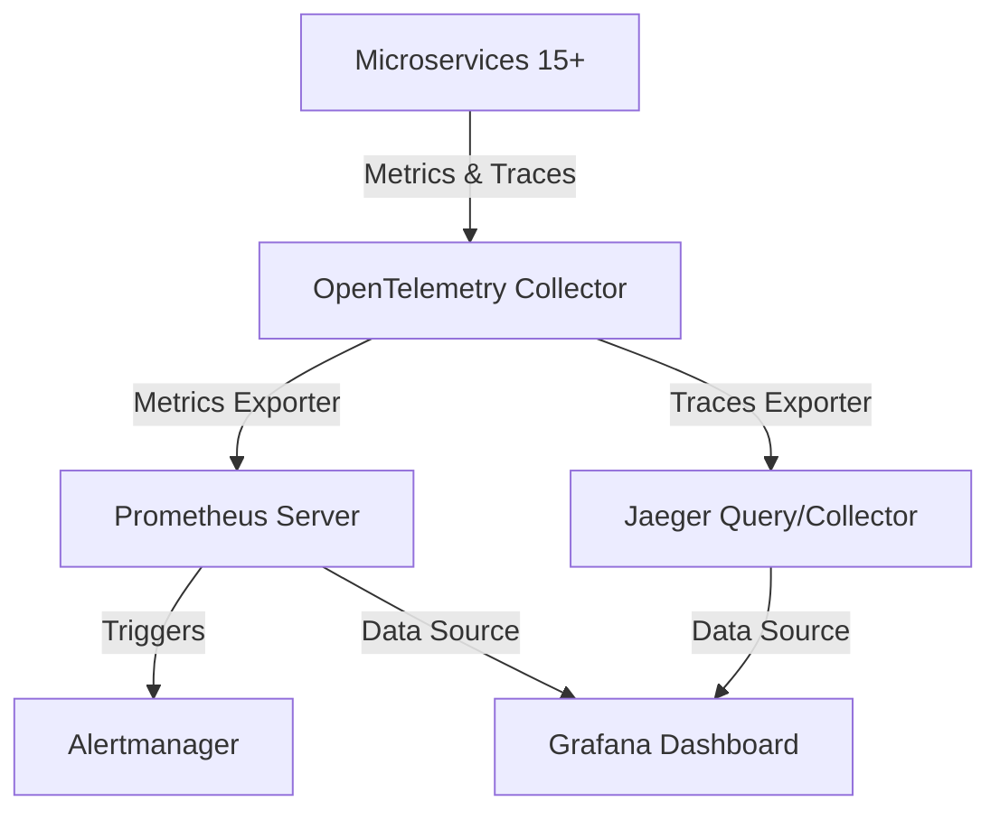

# 5. Observability and Alerting Strategy

Date: 2026-07-21

## Status

Accepted

## Context

With over 15+ independent microservices operating in our local Kubernetes cluster, diagnosing service failures, networking latencies, and transaction bottlenecks cannot be handled using localized container logging alone. We require:
1.  **Unified Telemetry Collection:** A single, standardized pipeline to ingest and route metrics and distributed traces.
2.  **Telemetry Storage & Querying:** High-performance, scalable backends to store metrics and trace files.
3.  **Visualization:** A single-pane-of-glass dashboard to visualize service graphs, latency spikes, and system health.
4.  **Proactive Alerting:** A declarative alert definition and routing engine to notify administrators of failures or degradations.

## Decision

We will implement a complete local observability stack integrated directly with the OpenTelemetry Astronomy Shop.

1.  **OpenTelemetry Collector as Telemetry Gateway:** The OTel Collector will receive all metrics and traces from the application services, process them, and export them to backend datastores. This prevents application services from coupling directly to specific vendor backends.
2.  **Prometheus for Metrics & Alerting:** We will enable the Prometheus sub-chart to collect and query metrics.
3.  **Alertmanager Integration:** We will enable the Alertmanager sub-chart within Prometheus to manage alerting lifecycle. We will configure declarative alerting rules at the Helm level:
    -   `ServiceTargetDown`: Availability alert using Prometheus standard scrape targets metrics.
    -   `OtelCollectorDroppedSpans`: Pipeline health alert looking at collector processor drop rate.
    -   `FrontendHighHttpErrorRate`: Application SLA/performance alert monitoring Frontend proxy HTTP 5xx responses.
4.  **Jaeger for Distributed Tracing:** Tracing spans collected by the OTel Collector will be exported to Jaeger for end-to-end distributed transaction tracking.
5.  **Grafana for Dashboards:** Grafana will query metrics from Prometheus and traces from Jaeger to display real-time analytics.

## Consequences

*   **Positive:** Standardized observability stack built on open standards (OpenTelemetry), preventing vendor lock-in.
*   **Positive:** Proactive system monitoring through automated alerting rules.
*   **Positive:** Correlation between metric spikes (Prometheus) and transaction trace graphs (Jaeger) within Grafana.
*   **Negative:** Significant cluster resource overhead. Running the full observability suite (Collector, Prometheus, Alertmanager, Jaeger, Grafana) increases Kind cluster memory usage by approximately 500MiB–800MiB.
*   **Neutral:** In a production cloud setting, local Prometheus/Jaeger storage would be replaced by cloud-managed services (e.g. AWS Managed Prometheus, AWS X-Ray, Datadog), but the OTel Collector pipeline configurations and alerting rules would remain largely identical.
